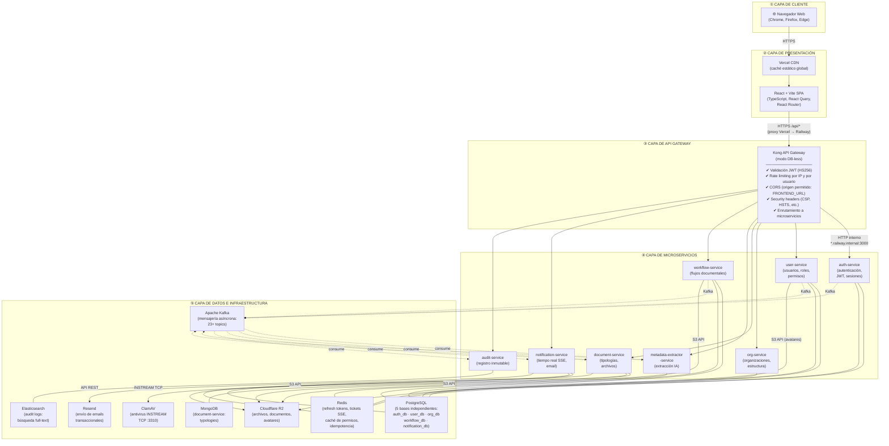
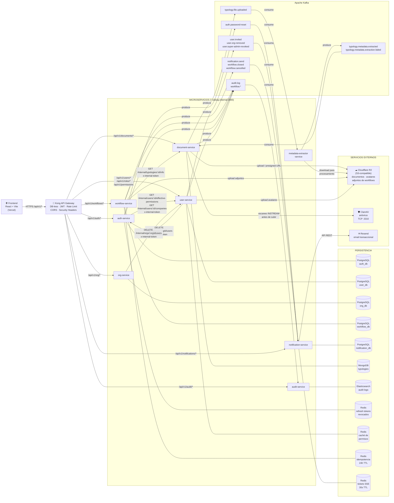
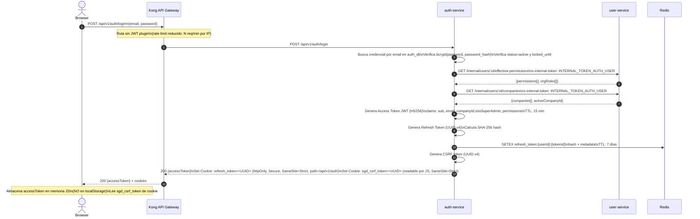
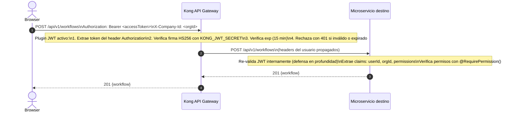
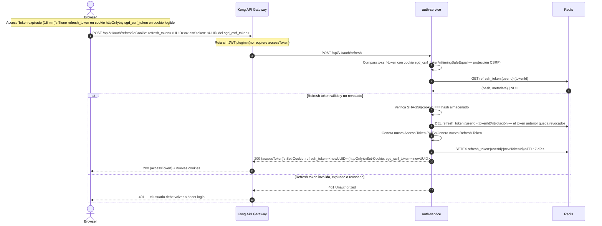
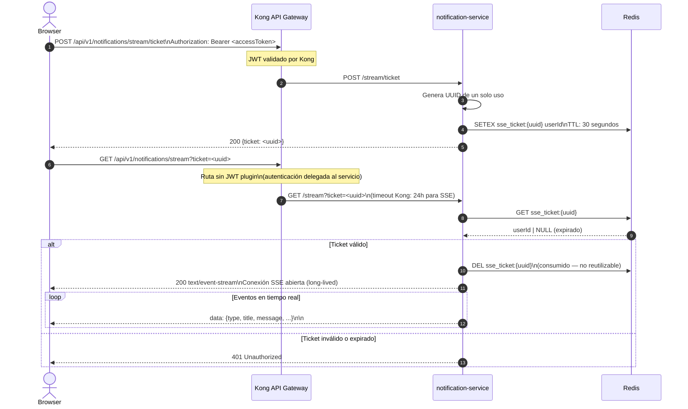

# Diagramas de Arquitectura — SGD Helisa

**Versión:** 1.0  
**Fecha:** 2026-06-19  
**Sistema:** Sistema de Gestión Documental (SGD) Helisa

---

## Contenido

1. [Diagrama de capas](#1-diagrama-de-capas)
2. [Diagrama de componentes](#2-diagrama-de-componentes)
3. [Flujo de autenticación](#3-flujo-de-autenticación)

---

## 1. Diagrama de capas

El sistema se organiza en cinco capas horizontales. Cada capa solo se comunica con la inmediatamente adyacente, siguiendo el principio de separación de responsabilidades.



### Descripción de capas

| Capa | Tecnología | Responsabilidad |
|---|---|---|
| **① Cliente** | Navegador web | Renderizado e interacción del usuario |
| **② Presentación** | React + Vite · Vercel CDN | SPA con enrutamiento client-side. Vercel sirve los estáticos desde CDN global y hace proxy de `/api/*` hacia Railway |
| **③ API Gateway** | Kong (DB-less) | Punto de entrada único. Valida JWT, aplica rate limiting y CORS antes de enrutar al microservicio correspondiente |
| **④ Microservicios** | NestJS (TypeScript) | 8 servicios independientes, cada uno dueño de su dominio de negocio y su base de datos |
| **⑤ Datos e Infraestructura** | PostgreSQL · MongoDB · Redis · Elasticsearch · Kafka · R2 · ClamAV · Resend | Persistencia, mensajería, almacenamiento de archivos y servicios externos |

---

## 2. Diagrama de componentes

Muestra cada microservicio como un componente con sus dependencias directas: bases de datos propias, servicios externos que consume y canales de comunicación hacia otros servicios.



### Rutas públicas vs. protegidas en Kong

| Ruta | Método | JWT requerido | Servicio destino |
|---|---|---|---|
| `/api/v1/auth/login` | POST | No | auth-service |
| `/api/v1/auth/forgot-password` | POST | No | auth-service |
| `/api/v1/auth/reset-password` | POST | No | auth-service |
| `/api/v1/auth/refresh` | POST | No (usa cookie) | auth-service |
| `/api/v1/users/complete-registration` | POST | No | user-service |
| `/api/v1/notifications/stream` | GET | No (usa ticket efímero) | notification-service |
| `/health` | GET | No | Kong (respuesta local) |
| Todas las demás rutas `/api/v1/*` | * | **Sí** | Microservicio correspondiente |

### Tokens internos entre servicios

Las llamadas HTTP entre microservicios usan tokens dedicados por par emisor-receptor. No circula el JWT del usuario en llamadas internas.

| Emisor | Receptor | Variable de entorno |
|---|---|---|
| auth-service | user-service | `INTERNAL_TOKEN_AUTH_USER` |
| user-service | auth-service | `INTERNAL_TOKEN_USER_AUTH` |
| org-service | user-service | `INTERNAL_TOKEN_ORG_USER` |
| user-service | org-service | `INTERNAL_TOKEN_USER_ORG` |
| workflow-service | document-service | `INTERNAL_TOKEN_WORKFLOW_DOC` |
| notification-service | user-service | `INTERNAL_TOKEN_NOTIF_USER` |
| notification-service | org-service | `INTERNAL_TOKEN_NOTIF_ORG` |

---

## 3. Flujo de autenticación

### 3.1 Login y emisión de tokens



### 3.2 Solicitud autenticada



### 3.3 Renovación del Access Token (Refresh)



### 3.4 Notificaciones en tiempo real (SSE con ticket efímero)

El navegador no puede enviar headers `Authorization` en conexiones `EventSource`. Para no exponer el JWT en la URL, se usa un ticket de un solo uso.



### 3.5 Cierre de sesión (Logout)

```mermaid
sequenceDiagram
    autonumber
    actor Browser
    participant Kong as Kong API Gateway
    participant Auth as auth-service
    participant Redis as Redis

    Browser->>Kong: POST /api/v1/auth/logout\nAuthorization: Bearer <accessToken>\nCookie: refresh_token=<UUID>\nx-csrf-token: <UUID>

    Note over Kong: JWT validado por Kong
    Kong->>Auth: POST /api/v1/auth/logout

    Auth->>Auth: Verifica CSRF (timingSafeEqual)
    Auth->>Redis: DEL refresh_token:{userId}:{tokenId}\n(revoca el refresh token inmediatamente)

    Auth-->>Kong: 200 OK\nSet-Cookie: refresh_token=; Max-Age=0 (elimina cookie)\nSet-Cookie: sgd_csrf_token=; Max-Age=0
    Kong-->>Browser: 200 OK + cookies eliminadas

    Note over Browser: Access Token sigue siendo técnicamente válido\nhasta su expiración natural (máx. 15 min)\nEn la práctica es inutilizable porque Kong\nno tiene lista de revocación de JWTs —\nel riesgo está acotado a la ventana de 15 min
```

---

### Resumen de seguridad en la capa de autenticación

| Mecanismo | Protección contra |
|---|---|
| JWT con TTL de 15 minutos | Ventana de exposición reducida si un token es interceptado |
| Refresh token en cookie `httpOnly` | Robo de token vía JavaScript (XSS) |
| Double-Submit Cookie (CSRF token) | Ataques CSRF en la operación de refresh |
| `SameSite=Strict` en cookies | CSRF en la mayoría de navegadores modernos |
| Ticket efímero para SSE (30s TTL) | Exposición del JWT en URL/logs al abrir stream SSE |
| Rate limiting por IP en `/login` | Ataques de fuerza bruta |
| `timingSafeEqual` en tokens internos | Timing attacks en comparación de secretos |
| CIDR check en llamadas internas (`100.64.0.0/10`) | Llamadas internas no autorizadas desde IPs externas |
| Kong como único punto de entrada | Superficie de ataque reducida; servicios no expuestos directamente |
