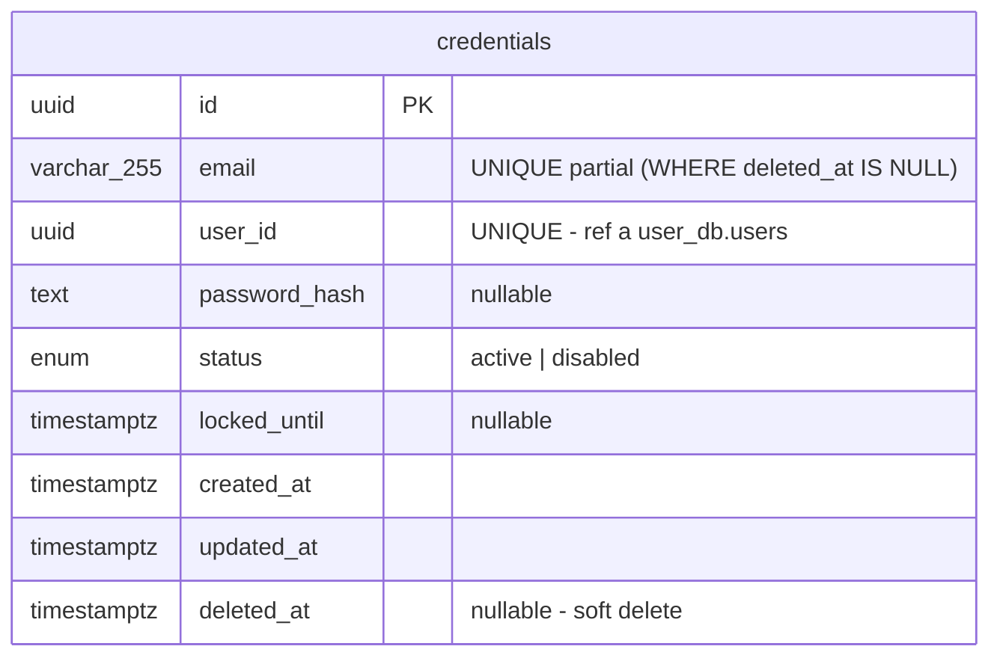
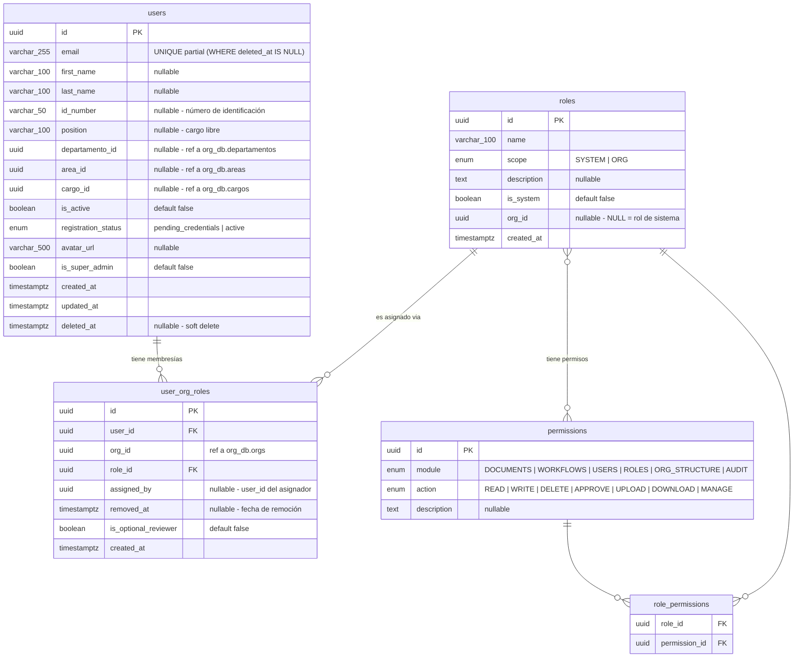
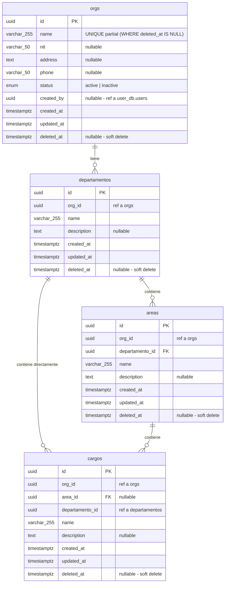
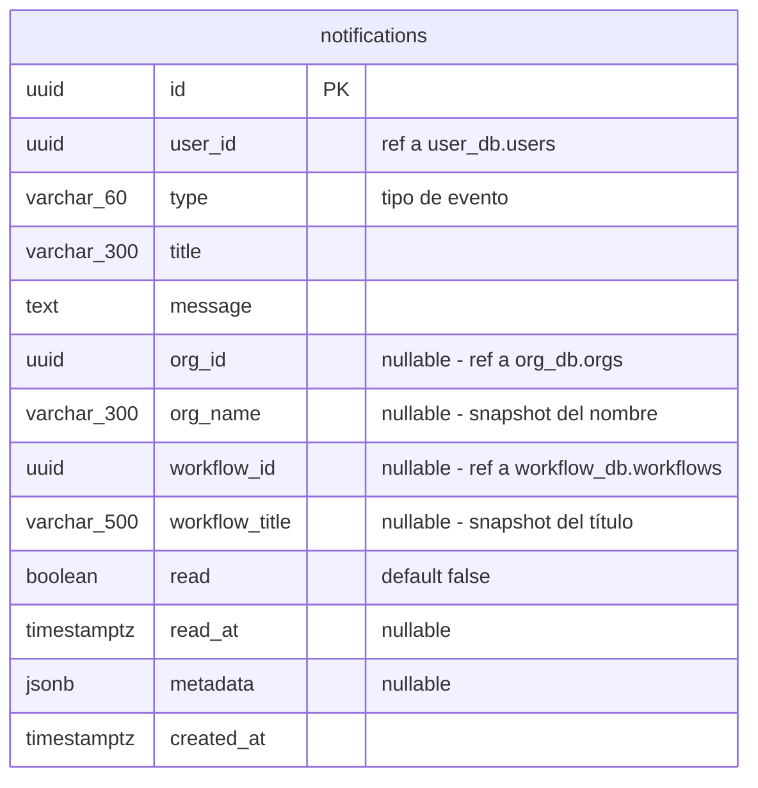
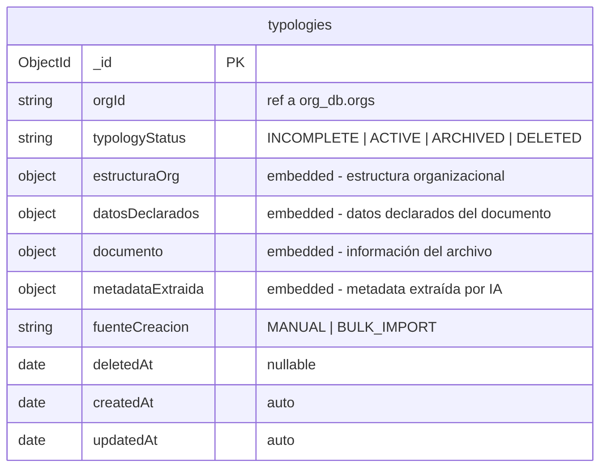
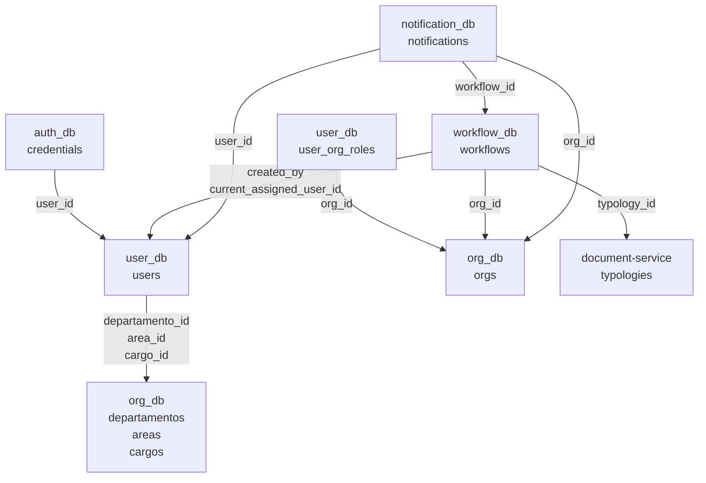

# Documentación de Bases de Datos — SGD Helisa

**Versión:** 1.0  
**Fecha:** 2026-06-19  
**Sistema:** Sistema de Gestión Documental (SGD) Helisa

---

## Contenido

1. [Arquitectura de datos](#1-arquitectura-de-datos)
2. [Base de datos: auth\_db](#2-base-de-datos-auth_db)
3. [Base de datos: user\_db](#3-base-de-datos-user_db)
4. [Base de datos: org\_db](#4-base-de-datos-org_db)
5. [Base de datos: workflow\_db](#5-base-de-datos-workflow_db)
6. [Base de datos: notification\_db](#6-base-de-datos-notification_db)
7. [Base de datos: document-service (MongoDB)](#7-base-de-datos-document-service-mongodb)
8. [Referencias cruzadas entre servicios](#8-referencias-cruzadas-entre-servicios)
9. [Catálogo de enumeraciones](#9-catálogo-de-enumeraciones)

---

## 1. Arquitectura de datos

El sistema SGD Helisa sigue el patrón **Database-per-Service**: cada microservicio gestiona su propia base de datos de forma independiente. No existen claves foráneas a nivel de motor de base de datos entre servicios; la integridad referencial entre servicios se garantiza en la capa de aplicación.

| Servicio | Motor | Base de datos |
|---|---|---|
| auth-service | PostgreSQL | `auth_db` |
| user-service | PostgreSQL | `user_db` |
| org-service | PostgreSQL | `org_db` |
| workflow-service | PostgreSQL | `workflow_db` |
| notification-service | PostgreSQL | `notification_db` |
| document-service | MongoDB | `document-service` (colección `typologies`) |

---

## 2. Base de datos: auth\_db

Gestiona las credenciales de autenticación (email, contraseña, estado de acceso).

### Diagrama ER



### Diccionario de datos — `credentials`

| Columna | Tipo | Nulo | Default | Descripción |
|---|---|---|---|---|
| `id` | UUID | No | `gen_random_uuid()` | Identificador único de la credencial |
| `email` | VARCHAR(255) | No | — | Dirección de correo electrónico del usuario |
| `user_id` | UUID | No | — | Referencia lógica al usuario en `user_db.users.id` |
| `password_hash` | TEXT | Sí | NULL | Hash bcrypt de la contraseña. NULL cuando el usuario no ha completado el registro |
| `status` | ENUM | No | `active` | Estado de la cuenta: `active` = activa, `disabled` = bloqueada por administrador |
| `locked_until` | TIMESTAMPTZ | Sí | NULL | Timestamp hasta el cual la cuenta está bloqueada por intentos fallidos |
| `created_at` | TIMESTAMPTZ | No | `now()` | Fecha y hora de creación |
| `updated_at` | TIMESTAMPTZ | No | `now()` | Fecha y hora de última modificación |
| `deleted_at` | TIMESTAMPTZ | Sí | NULL | Fecha de eliminación lógica (soft delete). NULL = registro activo |

**Índices:**
- `PK_credentials` — PRIMARY KEY (`id`)
- `UQ_credentials_user_id` — UNIQUE (`user_id`)
- `IDX_credentials_email_active` — UNIQUE (`email`) WHERE `deleted_at IS NULL` — permite reutilizar un email si la credencial anterior fue eliminada lógicamente

---

## 3. Base de datos: user\_db

Gestiona usuarios, roles, permisos y la asignación de roles a usuarios dentro de organizaciones.

### Diagrama ER



### Diccionario de datos — `users`

| Columna | Tipo | Nulo | Default | Descripción |
|---|---|---|---|---|
| `id` | UUID | No | `gen_random_uuid()` | Identificador único del usuario |
| `email` | VARCHAR(255) | No | — | Correo electrónico. Sincronizado con `auth_db.credentials.email` |
| `first_name` | VARCHAR(100) | Sí | NULL | Nombre(s) del usuario |
| `last_name` | VARCHAR(100) | Sí | NULL | Apellido(s) del usuario |
| `id_number` | VARCHAR(50) | Sí | NULL | Número de identificación (cédula, NIT, etc.) |
| `position` | VARCHAR(100) | Sí | NULL | Cargo o posición en texto libre (campo complementario a `cargo_id`) |
| `departamento_id` | UUID | Sí | NULL | Referencia al departamento en `org_db.departamentos.id` |
| `area_id` | UUID | Sí | NULL | Referencia al área en `org_db.areas.id` |
| `cargo_id` | UUID | Sí | NULL | Referencia al cargo en `org_db.cargos.id` |
| `is_active` | BOOLEAN | No | `false` | Si el usuario puede iniciar sesión. Se activa cuando completa el registro |
| `registration_status` | ENUM | No | `pending_credentials` | `pending_credentials` = invitado pero sin contraseña; `active` = registro completado |
| `avatar_url` | VARCHAR(500) | Sí | NULL | URL de la foto de perfil |
| `is_super_admin` | BOOLEAN | No | `false` | Superadministrador de plataforma con acceso irrestricto |
| `created_at` | TIMESTAMPTZ | No | `now()` | Fecha y hora de creación |
| `updated_at` | TIMESTAMPTZ | No | `now()` | Fecha y hora de última modificación |
| `deleted_at` | TIMESTAMPTZ | Sí | NULL | Fecha de eliminación lógica (soft delete) |

**Índices:**
- `PK_users` — PRIMARY KEY (`id`)
- `users_email_active_uniq` — UNIQUE (`email`) WHERE `deleted_at IS NULL`

---

### Diccionario de datos — `roles`

| Columna | Tipo | Nulo | Default | Descripción |
|---|---|---|---|---|
| `id` | UUID | No | `gen_random_uuid()` | Identificador único del rol |
| `name` | VARCHAR(100) | No | — | Nombre del rol. Ej: `ADMIN`, `EDITOR`, `VIEWER` |
| `scope` | ENUM | No | — | `SYSTEM` = rol predefinido de plataforma; `ORG` = rol personalizado por organización |
| `description` | TEXT | Sí | NULL | Descripción del propósito del rol |
| `is_system` | BOOLEAN | No | `false` | `true` = rol de sistema protegido, no editable por usuarios |
| `org_id` | UUID | Sí | NULL | Organización propietaria del rol. NULL = rol de sistema global |
| `created_at` | TIMESTAMPTZ | No | `now()` | Fecha y hora de creación |

**Índices:**
- `PK_roles` — PRIMARY KEY (`id`)
- `UQ_roles_name_org_id` — UNIQUE (`name`, `org_id`)
- `roles_name_system_uniq` — UNIQUE (`name`) WHERE `org_id IS NULL` — los nombres de roles de sistema son únicos globalmente
- `IDX_roles_org_id` — INDEX (`org_id`)

**Roles de sistema activos:**

| Nombre | Permisos |
|---|---|
| `ADMIN` | WORKFLOWS(READ, WRITE, DELETE, APPROVE, MANAGE), USERS(READ, WRITE, DELETE, MANAGE), ROLES(READ, WRITE), AUDIT(READ), ORG_STRUCTURE(READ, WRITE, DELETE) |
| `MANAGER` | WORKFLOWS(READ, WRITE, DELETE, APPROVE, MANAGE), USERS(READ), AUDIT(READ), ORG_STRUCTURE(READ, WRITE, DELETE) |
| `EDITOR` | WORKFLOWS(READ, WRITE, APPROVE), USERS(READ), ORG_STRUCTURE(READ) |
| `VIEWER` | WORKFLOWS(READ), ORG_STRUCTURE(READ) |
| `AUDITOR` | AUDIT(READ) |

---

### Diccionario de datos — `permissions`

| Columna | Tipo | Nulo | Default | Descripción |
|---|---|---|---|---|
| `id` | UUID | No | `gen_random_uuid()` | Identificador único del permiso |
| `module` | ENUM | No | — | Módulo del sistema al que aplica el permiso |
| `action` | ENUM | No | — | Acción permitida dentro del módulo |
| `description` | TEXT | Sí | NULL | Descripción legible del permiso |

**Módulos disponibles:** `DOCUMENTS`, `WORKFLOWS`, `USERS`, `ROLES`, `ORG_STRUCTURE`, `AUDIT`  
**Acciones disponibles:** `READ`, `WRITE`, `DELETE`, `APPROVE`, `UPLOAD`, `DOWNLOAD`, `MANAGE`

**Índices:**
- `PK_permissions` — PRIMARY KEY (`id`)
- `UQ_permissions_module_action` — UNIQUE (`module`, `action`)

---

### Diccionario de datos — `role_permissions` (tabla de unión)

| Columna | Tipo | Nulo | Descripción |
|---|---|---|---|
| `role_id` | UUID | No | FK → `roles(id)` ON DELETE CASCADE |
| `permission_id` | UUID | No | FK → `permissions(id)` ON DELETE CASCADE |

**Índices:**
- `PK_role_permissions` — PRIMARY KEY (`role_id`, `permission_id`)

---

### Diccionario de datos — `user_org_roles`

| Columna | Tipo | Nulo | Default | Descripción |
|---|---|---|---|---|
| `id` | UUID | No | `gen_random_uuid()` | Identificador único de la membresía |
| `user_id` | UUID | No | — | FK → `users(id)` ON DELETE CASCADE |
| `org_id` | UUID | No | — | Referencia a la organización en `org_db.orgs.id` |
| `role_id` | UUID | Sí | NULL | FK → `roles(id)` ON DELETE RESTRICT. NULL = miembro sin rol asignado |
| `assigned_by` | UUID | Sí | NULL | `user_id` del administrador que realizó la asignación |
| `removed_at` | TIMESTAMPTZ | Sí | NULL | Fecha y hora en que se removió la membresía. NULL = membresía activa |
| `is_optional_reviewer` | BOOLEAN | No | `false` | El usuario puede ser insertado como revisor opcional en ciclos administrativos de workflows |
| `created_at` | TIMESTAMPTZ | No | `now()` | Fecha y hora de creación |

**Índices:**
- `PK_user_org_roles` — PRIMARY KEY (`id`)
- `UQ_user_org_roles_user_org` — UNIQUE (`user_id`, `org_id`)
- `IDX_user_org_roles_user_id` — INDEX (`user_id`)
- `IDX_user_org_roles_org_id` — INDEX (`org_id`)
- `idx_user_org_roles_org_id_user_id` — INDEX CONCURRENTLY (`org_id`, `user_id`)

---

## 4. Base de datos: org\_db

Gestiona las organizaciones (empresas clientes) y su estructura jerárquica interna: departamentos → áreas → cargos.

### Diagrama ER



### Diccionario de datos — `orgs`

| Columna | Tipo | Nulo | Default | Descripción |
|---|---|---|---|---|
| `id` | UUID | No | `gen_random_uuid()` | Identificador único de la organización |
| `name` | VARCHAR(255) | No | — | Nombre de la organización. Único entre registros no eliminados |
| `nit` | VARCHAR(50) | Sí | NULL | Número de Identificación Tributaria |
| `address` | TEXT | Sí | NULL | Dirección fiscal de la organización |
| `phone` | VARCHAR(50) | Sí | NULL | Teléfono de contacto |
| `status` | ENUM | No | `active` | `active` = operativa; `inactive` = deshabilitada |
| `created_by` | UUID | Sí | NULL | Referencia al usuario que creó la organización (`user_db.users.id`) |
| `created_at` | TIMESTAMPTZ | No | `now()` | Fecha y hora de creación |
| `updated_at` | TIMESTAMPTZ | No | `now()` | Fecha y hora de última modificación |
| `deleted_at` | TIMESTAMPTZ | Sí | NULL | Fecha de eliminación lógica (soft delete) |

**Índices:**
- `PK_orgs` — PRIMARY KEY (`id`)
- `IDX_orgs_name` — UNIQUE (`name`) (parcial WHERE `deleted_at IS NULL`)
- `idx_orgs_name_trgm` — GIN trigram (`name`) — búsqueda por similitud de texto
- `idx_orgs_nit_trgm` — GIN trigram (`nit`) — búsqueda por similitud de texto

---

### Diccionario de datos — `departamentos`

| Columna | Tipo | Nulo | Default | Descripción |
|---|---|---|---|---|
| `id` | UUID | No | `gen_random_uuid()` | Identificador único del departamento |
| `org_id` | UUID | No | — | Organización a la que pertenece el departamento |
| `name` | VARCHAR(255) | No | — | Nombre del departamento |
| `description` | TEXT | Sí | NULL | Descripción del departamento |
| `created_at` | TIMESTAMPTZ | No | `now()` | Fecha y hora de creación |
| `updated_at` | TIMESTAMPTZ | No | `now()` | Fecha y hora de última modificación |
| `deleted_at` | TIMESTAMPTZ | Sí | NULL | Fecha de eliminación lógica (soft delete) |

**Índices:**
- `PK_departamentos` — PRIMARY KEY (`id`)
- UNIQUE parcial (`org_id`, `name`) WHERE `deleted_at IS NULL` — un nombre de departamento es único dentro de una organización activa
- `IDX_departamentos_org_id` — INDEX (`org_id`)

---

### Diccionario de datos — `areas`

| Columna | Tipo | Nulo | Default | Descripción |
|---|---|---|---|---|
| `id` | UUID | No | `gen_random_uuid()` | Identificador único del área |
| `org_id` | UUID | No | — | Organización a la que pertenece el área |
| `departamento_id` | UUID | No | — | FK → `departamentos(id)` ON DELETE RESTRICT |
| `name` | VARCHAR(255) | No | — | Nombre del área |
| `description` | TEXT | Sí | NULL | Descripción del área |
| `created_at` | TIMESTAMPTZ | No | `now()` | Fecha y hora de creación |
| `updated_at` | TIMESTAMPTZ | No | `now()` | Fecha y hora de última modificación |
| `deleted_at` | TIMESTAMPTZ | Sí | NULL | Fecha de eliminación lógica (soft delete) |

**Índices:**
- `PK_areas` — PRIMARY KEY (`id`)
- UNIQUE parcial (`departamento_id`, `name`) WHERE `deleted_at IS NULL`
- `IDX_areas_org_id` — INDEX (`org_id`)
- `IDX_areas_departamento_id` — INDEX (`departamento_id`)

---

### Diccionario de datos — `cargos`

| Columna | Tipo | Nulo | Default | Descripción |
|---|---|---|---|---|
| `id` | UUID | No | `gen_random_uuid()` | Identificador único del cargo |
| `org_id` | UUID | No | — | Organización a la que pertenece el cargo |
| `area_id` | UUID | Sí | NULL | FK → `areas(id)` ON DELETE RESTRICT. NULL = cargo adscrito directamente al departamento |
| `departamento_id` | UUID | No | — | Departamento al que pertenece el cargo |
| `name` | VARCHAR(255) | No | — | Nombre del cargo |
| `description` | TEXT | Sí | NULL | Descripción del cargo |
| `created_at` | TIMESTAMPTZ | No | `now()` | Fecha y hora de creación |
| `updated_at` | TIMESTAMPTZ | No | `now()` | Fecha y hora de última modificación |
| `deleted_at` | TIMESTAMPTZ | Sí | NULL | Fecha de eliminación lógica (soft delete) |

**Índices:**
- `PK_cargos` — PRIMARY KEY (`id`)
- UNIQUE parcial (`area_id`, `name`) WHERE `area_id IS NOT NULL AND deleted_at IS NULL`
- UNIQUE parcial (`departamento_id`, `name`) WHERE `area_id IS NULL AND deleted_at IS NULL`
- `IDX_cargos_org_id` — INDEX (`org_id`)
- `IDX_cargos_area_id` — INDEX (`area_id`)
- `IDX_cargos_departamento_id` — INDEX (`departamento_id`)

---

## 5. Base de datos: workflow\_db

Gestiona el ciclo de vida completo de los flujos documentales: creación, aprobación, ciclos administrativos, adjuntos, notas y auditoría de eventos.

### Diagrama ER

```mermaid
erDiagram
    workflows {
        uuid id PK
        uuid org_id "ref a org_db.orgs"
        varchar_500 title
        text description "nullable"
        varchar_24 typology_id "ObjectId MongoDB"
        varchar_100 typology_code
        varchar_50 typology_version
        varchar_500 typology_name
        varchar_255 main_document_id "nullable"
        boolean main_document_validated
        jsonb main_document_metadata "nullable"
        enum status
        int current_approval_step_order "nullable"
        uuid rejected_at_step_id "nullable"
        uuid current_assigned_user_id "nullable"
        uuid_array final_user_ids "nullable"
        uuid active_admin_cycle_id "nullable"
        uuid created_by "ref a user_db.users"
        uuid closed_by "nullable"
        timestamptz closed_at "nullable"
        uuid cancelled_by "nullable"
        timestamptz cancelled_at "nullable"
        jsonb metadata "nullable"
        timestamptz created_at
        timestamptz updated_at
        timestamptz deleted_at "nullable"
    }

    workflow_approval_steps {
        uuid id PK
        uuid workflow_id FK
        uuid user_id "ref a user_db.users"
        int step_order
        enum status "WAITING | PENDING | APPROVED | REJECTED"
        timestamptz completed_at "nullable"
        timestamptz created_at
        timestamptz updated_at
    }

    workflow_approval_actions {
        uuid id PK
        uuid workflow_id "ref a workflows"
        uuid step_id FK
        uuid user_id "ref a user_db.users"
        enum action "APPROVED | REJECTED"
        text observations "nullable"
        int attempt_number
        jsonb attachments "array de objetos archivo"
        timestamptz created_at
    }

    workflow_attachments {
        uuid id PK
        uuid workflow_id FK
        uuid uploaded_by "ref a user_db.users"
        varchar_255 document_id "ref a document-service"
        varchar_500 storage_key
        varchar_500 original_name
        varchar_100 mime_type
        bigint file_size_bytes "nullable"
        enum attachment_type "MAIN_DOCUMENT | SUPPORTING"
        timestamptz created_at
    }

    workflow_admin_cycles {
        uuid id PK
        uuid workflow_id FK
        int cycle_number
        uuid initiated_by "ref a user_db.users"
        enum status "IN_PROGRESS | COMPLETED"
        int current_step_order "nullable"
        timestamptz completed_at "nullable"
        uuid_array allowed_optional_reviewer_ids
        jsonb metadata "nullable"
        timestamptz created_at
        timestamptz updated_at
    }

    workflow_admin_steps {
        uuid id PK
        uuid cycle_id FK
        uuid workflow_id "desnormalizado"
        uuid user_id "ref a user_db.users"
        int step_order
        enum status "WAITING | PENDING | COMPLETED"
        boolean is_optional
        uuid inserted_by_step_id FK_self "nullable"
        timestamptz completed_at "nullable"
        timestamptz created_at
        timestamptz updated_at
    }

    workflow_admin_attachments {
        uuid id PK
        uuid workflow_id "ref a workflows"
        uuid cycle_id "ref a workflow_admin_cycles"
        uuid step_id FK
        uuid uploaded_by "ref a user_db.users"
        varchar_255 document_id "ref a document-service"
        varchar_500 storage_key
        varchar_500 original_name
        varchar_100 mime_type
        bigint file_size_bytes "nullable"
        timestamptz created_at
    }

    workflow_notes {
        uuid id PK
        uuid workflow_id FK
        uuid cycle_id "nullable"
        uuid admin_step_id FK "nullable"
        uuid created_by "ref a user_db.users"
        text content
        timestamptz created_at
    }

    workflow_timeline {
        uuid id PK
        uuid workflow_id FK
        enum event_type
        uuid actor_id "ref a user_db.users"
        uuid target_user_id "nullable"
        text description
        jsonb metadata "nullable"
        timestamptz created_at
    }

    workflow_idempotency_keys {
        varchar_255 idem_key PK
        uuid user_id "ref a user_db.users"
        text response
        timestamptz expires_at
        timestamptz created_at
    }

    workflows ||--|{ workflow_approval_steps : "tiene pasos de aprobación"
    workflows ||--o{ workflow_attachments : "tiene adjuntos"
    workflows ||--o{ workflow_admin_cycles : "tiene ciclos admin"
    workflows ||--o{ workflow_notes : "tiene notas"
    workflows ||--o{ workflow_timeline : "tiene historial"
    workflow_approval_steps ||--o{ workflow_approval_actions : "tiene acciones"
    workflow_admin_cycles ||--|{ workflow_admin_steps : "tiene pasos"
    workflow_admin_steps ||--o{ workflow_admin_attachments : "tiene adjuntos"
    workflow_admin_steps ||--o{ workflow_notes : "puede tener notas"
    workflow_admin_steps }o--o| workflow_admin_steps : "insertado por"
```

### Diccionario de datos — `workflows`

| Columna | Tipo | Nulo | Default | Descripción |
|---|---|---|---|---|
| `id` | UUID | No | `gen_random_uuid()` | Identificador único del flujo documental |
| `org_id` | UUID | No | — | Organización propietaria del workflow |
| `title` | VARCHAR(500) | No | — | Título descriptivo del workflow |
| `description` | TEXT | Sí | NULL | Descripción adicional |
| `typology_id` | VARCHAR(24) | No | — | ObjectId de MongoDB de la tipología documental asociada |
| `typology_code` | VARCHAR(100) | No | — | Código de la tipología (snapshot al momento de creación) |
| `typology_version` | VARCHAR(50) | No | — | Versión de la tipología (snapshot) |
| `typology_name` | VARCHAR(500) | No | — | Nombre de la tipología (snapshot) |
| `main_document_id` | VARCHAR(255) | Sí | NULL | Referencia al documento principal en el servicio de documentos |
| `main_document_validated` | BOOLEAN | No | `false` | Si el documento principal fue validado por el sistema |
| `main_document_metadata` | JSONB | Sí | NULL | Metadatos extraídos del documento principal |
| `status` | ENUM | No | `DRAFT` | Estado actual del workflow (ver Catálogo de Enumeraciones) |
| `current_approval_step_order` | INT | Sí | NULL | Número de orden del paso de aprobación activo |
| `rejected_at_step_id` | UUID | Sí | NULL | ID del paso donde fue rechazado (si aplica) |
| `current_assigned_user_id` | UUID | Sí | NULL | Usuario actualmente asignado para acción |
| `final_user_ids` | UUID[] | Sí | NULL | IDs de usuarios finales que recibirán el workflow completado |
| `active_admin_cycle_id` | UUID | Sí | NULL | Ciclo administrativo activo en curso |
| `created_by` | UUID | No | — | Usuario que creó el workflow |
| `closed_by` | UUID | Sí | NULL | Usuario que cerró el workflow |
| `closed_at` | TIMESTAMPTZ | Sí | NULL | Fecha y hora de cierre |
| `cancelled_by` | UUID | Sí | NULL | Usuario que canceló el workflow |
| `cancelled_at` | TIMESTAMPTZ | Sí | NULL | Fecha y hora de cancelación |
| `metadata` | JSONB | Sí | NULL | Información adicional de contexto |
| `created_at` | TIMESTAMPTZ | No | `now()` | Fecha y hora de creación |
| `updated_at` | TIMESTAMPTZ | No | `now()` | Fecha y hora de última modificación |
| `deleted_at` | TIMESTAMPTZ | Sí | NULL | Fecha de eliminación lógica |

**Índices:**
- `PK_workflows` — PRIMARY KEY (`id`)
- `IDX_workflows_org_status` — INDEX (`org_id`, `status`)
- `IDX_workflows_org_created` — INDEX (`org_id`, `created_at`)
- `IDX_workflows_created_by` — INDEX (`created_by`)
- `IDX_workflows_assigned_user` — INDEX (`current_assigned_user_id`)

---

### Diccionario de datos — `workflow_approval_steps`

| Columna | Tipo | Nulo | Default | Descripción |
|---|---|---|---|---|
| `id` | UUID | No | `gen_random_uuid()` | Identificador único del paso |
| `workflow_id` | UUID | No | — | FK → `workflows(id)` ON DELETE CASCADE |
| `user_id` | UUID | No | — | Usuario aprobador asignado a este paso |
| `step_order` | INT | No | — | Número de orden secuencial del paso (1, 2, 3, ...) |
| `status` | ENUM | No | `WAITING` | `WAITING` = aún no es su turno; `PENDING` = esperando acción; `APPROVED` = aprobado; `REJECTED` = rechazado |
| `completed_at` | TIMESTAMPTZ | Sí | NULL | Fecha y hora en que se completó el paso |
| `created_at` | TIMESTAMPTZ | No | `now()` | Fecha y hora de creación |
| `updated_at` | TIMESTAMPTZ | No | `now()` | Fecha y hora de última modificación |

**Índices:**
- `PK_workflow_approval_steps` — PRIMARY KEY (`id`)
- `UQ_approval_steps_workflow_order` — UNIQUE (`workflow_id`, `step_order`)
- `IDX_approval_steps_workflow_id` — INDEX (`workflow_id`)
- `IDX_approval_steps_user_status` — INDEX (`user_id`, `status`)

---

### Diccionario de datos — `workflow_approval_actions`

Registro inmutable (solo INSERT) de cada acción de aprobación o rechazo.

| Columna | Tipo | Nulo | Default | Descripción |
|---|---|---|---|---|
| `id` | UUID | No | `gen_random_uuid()` | Identificador único de la acción |
| `workflow_id` | UUID | No | — | Referencia al workflow |
| `step_id` | UUID | No | — | FK → `workflow_approval_steps(id)` ON DELETE CASCADE |
| `user_id` | UUID | No | — | Usuario que realizó la acción |
| `action` | ENUM | No | — | `APPROVED` o `REJECTED` |
| `observations` | TEXT | Sí | NULL | Comentarios u observaciones del aprobador |
| `attempt_number` | INT | No | `1` | Número de intento (incrementa si el workflow es devuelto y resubmitido) |
| `attachments` | JSONB | No | `[]` | Array de archivos adjuntados a la acción. Estructura: `[{storageKey, originalName, mimeType, fileSizeBytes}]` |
| `created_at` | TIMESTAMPTZ | No | `now()` | Fecha y hora de la acción |

**Índices:**
- `PK_workflow_approval_actions` — PRIMARY KEY (`id`)
- `IDX_actions_workflow_id` — INDEX (`workflow_id`)
- `IDX_actions_step_id` — INDEX (`step_id`)

---

### Diccionario de datos — `workflow_attachments`

| Columna | Tipo | Nulo | Default | Descripción |
|---|---|---|---|---|
| `id` | UUID | No | `gen_random_uuid()` | Identificador único del adjunto |
| `workflow_id` | UUID | No | — | FK → `workflows(id)` ON DELETE CASCADE |
| `uploaded_by` | UUID | No | — | Usuario que subió el archivo |
| `document_id` | VARCHAR(255) | No | — | Referencia al documento en el servicio de documentos |
| `storage_key` | VARCHAR(500) | No | — | Clave de almacenamiento en Cloudflare R2 |
| `original_name` | VARCHAR(500) | No | — | Nombre original del archivo |
| `mime_type` | VARCHAR(100) | No | — | Tipo MIME del archivo (ej: `application/pdf`) |
| `file_size_bytes` | BIGINT | Sí | NULL | Tamaño del archivo en bytes |
| `attachment_type` | ENUM | No | `SUPPORTING` | `MAIN_DOCUMENT` = documento principal; `SUPPORTING` = adjunto de soporte |
| `created_at` | TIMESTAMPTZ | No | `now()` | Fecha y hora de carga |

**Índices:**
- `PK_workflow_attachments` — PRIMARY KEY (`id`)
- `IDX_attachments_workflow_id` — INDEX (`workflow_id`)

---

### Diccionario de datos — `workflow_admin_cycles`

| Columna | Tipo | Nulo | Default | Descripción |
|---|---|---|---|---|
| `id` | UUID | No | `gen_random_uuid()` | Identificador único del ciclo administrativo |
| `workflow_id` | UUID | No | — | FK → `workflows(id)` ON DELETE CASCADE |
| `cycle_number` | INT | No | `1` | Número secuencial del ciclo dentro del workflow |
| `initiated_by` | UUID | No | — | Usuario que inició el ciclo administrativo |
| `status` | ENUM | No | `IN_PROGRESS` | `IN_PROGRESS` = en curso; `COMPLETED` = finalizado |
| `current_step_order` | INT | Sí | NULL | Número de orden del paso administrativo activo |
| `completed_at` | TIMESTAMPTZ | Sí | NULL | Fecha y hora de finalización |
| `allowed_optional_reviewer_ids` | UUID[] | No | `{}` | IDs de revisores opcionales que pueden ser insertados en este ciclo |
| `metadata` | JSONB | Sí | NULL | Información adicional del ciclo |
| `created_at` | TIMESTAMPTZ | No | `now()` | Fecha y hora de creación |
| `updated_at` | TIMESTAMPTZ | No | `now()` | Fecha y hora de última modificación |

**Índices:**
- `PK_workflow_admin_cycles` — PRIMARY KEY (`id`)
- `UQ_admin_cycles_workflow_cycle` — UNIQUE (`workflow_id`, `cycle_number`)
- `IDX_admin_cycles_workflow_id` — INDEX (`workflow_id`)

---

### Diccionario de datos — `workflow_admin_steps`

| Columna | Tipo | Nulo | Default | Descripción |
|---|---|---|---|---|
| `id` | UUID | No | `gen_random_uuid()` | Identificador único del paso administrativo |
| `cycle_id` | UUID | No | — | FK → `workflow_admin_cycles(id)` ON DELETE CASCADE |
| `workflow_id` | UUID | No | — | Desnormalización del `workflow_id` para facilitar consultas directas |
| `user_id` | UUID | No | — | Usuario responsable de este paso |
| `step_order` | INT | No | — | Número de orden del paso dentro del ciclo |
| `status` | ENUM | No | `WAITING` | `WAITING` = aún no es su turno; `PENDING` = esperando acción; `COMPLETED` = completado |
| `is_optional` | BOOLEAN | No | `false` | Si el paso fue insertado por un revisor opcional |
| `inserted_by_step_id` | UUID | Sí | NULL | FK → `workflow_admin_steps(id)` ON DELETE SET NULL. ID del paso que insertó este paso opcional |
| `completed_at` | TIMESTAMPTZ | Sí | NULL | Fecha y hora de completación |
| `created_at` | TIMESTAMPTZ | No | `now()` | Fecha y hora de creación |
| `updated_at` | TIMESTAMPTZ | No | `now()` | Fecha y hora de última modificación |

**Índices:**
- `PK_workflow_admin_steps` — PRIMARY KEY (`id`)
- `UQ_admin_steps_cycle_order` — UNIQUE (`cycle_id`, `step_order`)
- `IDX_admin_steps_cycle_id` — INDEX (`cycle_id`)
- `IDX_admin_steps_workflow_id` — INDEX (`workflow_id`)

---

### Diccionario de datos — `workflow_admin_attachments`

| Columna | Tipo | Nulo | Default | Descripción |
|---|---|---|---|---|
| `id` | UUID | No | `gen_random_uuid()` | Identificador único del adjunto |
| `workflow_id` | UUID | No | — | Referencia al workflow (desnormalizado) |
| `cycle_id` | UUID | No | — | Referencia al ciclo administrativo (desnormalizado) |
| `step_id` | UUID | No | — | FK → `workflow_admin_steps(id)` ON DELETE CASCADE |
| `uploaded_by` | UUID | No | — | Usuario que subió el archivo |
| `document_id` | VARCHAR(255) | No | — | Referencia al documento en el servicio de documentos |
| `storage_key` | VARCHAR(500) | No | — | Clave de almacenamiento en Cloudflare R2 |
| `original_name` | VARCHAR(500) | No | — | Nombre original del archivo |
| `mime_type` | VARCHAR(100) | No | — | Tipo MIME del archivo |
| `file_size_bytes` | BIGINT | Sí | NULL | Tamaño del archivo en bytes |
| `created_at` | TIMESTAMPTZ | No | `now()` | Fecha y hora de carga |

**Índices:**
- `PK_workflow_admin_attachments` — PRIMARY KEY (`id`)
- `IDX_admin_attachments_workflow_id` — INDEX (`workflow_id`)
- `IDX_admin_attachments_cycle_id` — INDEX (`cycle_id`)
- `IDX_admin_attachments_step_id` — INDEX (`step_id`)

---

### Diccionario de datos — `workflow_notes`

Registro inmutable (solo INSERT). Las notas no se editan ni eliminan.

| Columna | Tipo | Nulo | Default | Descripción |
|---|---|---|---|---|
| `id` | UUID | No | `gen_random_uuid()` | Identificador único de la nota |
| `workflow_id` | UUID | No | — | FK → `workflows(id)` ON DELETE CASCADE |
| `cycle_id` | UUID | Sí | NULL | Ciclo administrativo al que pertenece la nota (si aplica) |
| `admin_step_id` | UUID | Sí | NULL | FK → `workflow_admin_steps(id)` ON DELETE SET NULL |
| `created_by` | UUID | No | — | Usuario que creó la nota |
| `content` | TEXT | No | — | Contenido de la nota |
| `created_at` | TIMESTAMPTZ | No | `now()` | Fecha y hora de creación |

**Índices:**
- `PK_workflow_notes` — PRIMARY KEY (`id`)
- `IDX_notes_workflow_id` — INDEX (`workflow_id`)

---

### Diccionario de datos — `workflow_timeline`

Registro inmutable (solo INSERT). Auditoría de todos los eventos del workflow.

| Columna | Tipo | Nulo | Default | Descripción |
|---|---|---|---|---|
| `id` | UUID | No | `gen_random_uuid()` | Identificador único del evento |
| `workflow_id` | UUID | No | — | FK → `workflows(id)` ON DELETE CASCADE |
| `event_type` | ENUM | No | — | Tipo de evento (ver Catálogo de Enumeraciones) |
| `actor_id` | UUID | No | — | Usuario que desencadenó el evento |
| `target_user_id` | UUID | Sí | NULL | Usuario al que va dirigido el evento (ej: usuario asignado) |
| `description` | TEXT | No | — | Descripción legible del evento |
| `metadata` | JSONB | Sí | NULL | Datos adicionales del evento (ej: nombre del paso, acción tomada) |
| `created_at` | TIMESTAMPTZ | No | `now()` | Fecha y hora del evento |

**Índices:**
- `PK_workflow_timeline` — PRIMARY KEY (`id`)
- `IDX_timeline_workflow_id` — INDEX (`workflow_id`)
- `IDX_timeline_workflow_created` — INDEX (`workflow_id`, `created_at`)

---

### Diccionario de datos — `workflow_idempotency_keys`

Garantiza que operaciones críticas (crear workflow, completar paso) no se ejecuten dos veces si el cliente reintenta la solicitud.

| Columna | Tipo | Nulo | Default | Descripción |
|---|---|---|---|---|
| `idem_key` | VARCHAR(255) | No | — | **PK**. Clave de idempotencia generada por el cliente |
| `user_id` | UUID | No | — | Usuario al que pertenece la clave |
| `response` | TEXT | No | — | Respuesta HTTP serializada que se devuelve en reintentos |
| `expires_at` | TIMESTAMPTZ | No | — | Fecha y hora de expiración de la clave |
| `created_at` | TIMESTAMPTZ | No | `now()` | Fecha y hora de creación |

**Índices:**
- `PK_idempotency_keys` — PRIMARY KEY (`idem_key`)
- `idx_workflow_idempotency_keys_expires_at` — INDEX (`expires_at`) — para limpieza periódica de claves expiradas

---

## 6. Base de datos: notification\_db

Gestiona las notificaciones enviadas a los usuarios sobre eventos relevantes del sistema.

### Diagrama ER



### Diccionario de datos — `notifications`

| Columna | Tipo | Nulo | Default | Descripción |
|---|---|---|---|---|
| `id` | UUID | No | `gen_random_uuid()` | Identificador único de la notificación |
| `user_id` | UUID | No | — | Usuario destinatario de la notificación |
| `type` | VARCHAR(60) | No | — | Tipo de evento que generó la notificación (ver valores abajo) |
| `title` | VARCHAR(300) | No | — | Título corto de la notificación |
| `message` | TEXT | No | — | Mensaje completo de la notificación |
| `org_id` | UUID | Sí | NULL | Organización relacionada con la notificación |
| `org_name` | VARCHAR(300) | Sí | NULL | Nombre de la organización (snapshot para lectura rápida) |
| `workflow_id` | UUID | Sí | NULL | Workflow relacionado con la notificación |
| `workflow_title` | VARCHAR(500) | Sí | NULL | Título del workflow (snapshot) |
| `read` | BOOLEAN | No | `false` | Si el usuario ha leído la notificación |
| `read_at` | TIMESTAMPTZ | Sí | NULL | Fecha y hora en que fue marcada como leída |
| `metadata` | JSONB | Sí | NULL | Información adicional sobre el evento |
| `created_at` | TIMESTAMPTZ | No | `now()` | Fecha y hora de creación |

**Tipos de notificación (`type`):**

| Valor | Descripción |
|---|---|
| `WORKFLOW_TASK_ASSIGNED` | Se asignó una tarea de aprobación al usuario |
| `WORKFLOW_APPROVED` | El workflow fue aprobado completamente |
| `WORKFLOW_REJECTED` | El workflow fue rechazado en algún paso |
| `ADMIN_CYCLE_TASK` | Se asignó una tarea de ciclo administrativo |
| `ADMIN_CYCLE_COMPLETED` | Un ciclo administrativo fue completado |
| `WORKFLOW_CLOSED` | El workflow fue cerrado |
| `NO_FINAL_USER_ALERT` | Alerta de workflow sin usuarios finales asignados |

**Índices:**
- `PK_notifications` — PRIMARY KEY (`id`)
- `IDX_notifications_user_id` — INDEX (`user_id`)
- `IDX_notifications_user_id_read` — INDEX (`user_id`, `read`) — para consultas de notificaciones no leídas
- `IDX_notifications_created_at` — INDEX (`created_at DESC`) — para paginación cronológica
- `IDX_notifications_org_id` — INDEX (`org_id`)

---

## 7. Base de datos: document-service (MongoDB)

Gestiona las tipologías documentales que definen la estructura y metadatos de cada tipo de documento que una organización puede tramitar.

### Diagrama de colección



### Diccionario de datos — Colección `typologies`

**Documento raíz:**

| Campo | Tipo | Requerido | Default | Descripción |
|---|---|---|---|---|
| `_id` | ObjectId | Sí (auto) | — | Identificador único generado por MongoDB |
| `orgId` | String | Sí | — | ID de la organización propietaria (UUID de `org_db.orgs.id`) |
| `typologyStatus` | String (ENUM) | No | `INCOMPLETE` | Estado de la tipología (ver valores abajo) |
| `estructuraOrg` | Object | Sí | — | Estructura organizacional asociada (embedded) |
| `datosDeclarados` | Object | No | `{}` | Datos del documento declarados manualmente (embedded) |
| `documento` | Object | No | `{}` | Información del archivo cargado (embedded) |
| `metadataExtraida` | Object | No | `{}` | Metadatos extraídos automáticamente del documento (embedded) |
| `fuenteCreacion` | String (ENUM) | No | `MANUAL` | `MANUAL` = creada por usuario; `BULK_IMPORT` = importada masivamente |
| `deletedAt` | Date | No | `null` | Fecha de eliminación lógica |
| `createdAt` | Date | Auto | — | Fecha de creación (Mongoose timestamps) |
| `updatedAt` | Date | Auto | — | Fecha de última modificación (Mongoose timestamps) |

**Estados de tipología (`typologyStatus`):**

| Valor | Descripción |
|---|---|
| `INCOMPLETE` | Tipología en proceso de configuración, no disponible para workflows |
| `ACTIVE` | Tipología activa, disponible para crear workflows |
| `ARCHIVED` | Tipología archivada, no disponible pero conservada históricamente |
| `DELETED` | Tipología eliminada lógicamente |

---

**Subdocumento: `estructuraOrg`**

| Campo | Tipo | Requerido | Descripción |
|---|---|---|---|
| `departamentoId` | String | Sí | ID del departamento en `org_db.departamentos.id` |
| `departamentoNombre` | String | Sí | Nombre del departamento (snapshot) |
| `areaId` | String | No | ID del área en `org_db.areas.id`. Null si no aplica |
| `areaNombre` | String | No | Nombre del área (snapshot) |
| `cargoId` | String | No | ID del cargo en `org_db.cargos.id`. Null si no aplica |
| `cargoNombre` | String | No | Nombre del cargo (snapshot) |

---

**Subdocumento: `datosDeclarados`**

| Campo | Tipo | Default | Descripción |
|---|---|---|---|
| `nombre` | String | `null` | Nombre del documento declarado por el usuario |
| `codigo` | String | `null` | Código de clasificación del documento |
| `version` | String | `null` | Versión del documento |
| `fuente` | String (ENUM) | `MANUAL` | `EXCEL` = ingresado vía importación; `MANUAL` = ingresado manualmente; `CONFIRMED_FROM_EXTRACTION` = confirmado desde extracción automática |

---

**Subdocumento: `documento`**

| Campo | Tipo | Default | Descripción |
|---|---|---|---|
| `r2Key` | String | `null` | Clave del archivo en Cloudflare R2 |
| `originalName` | String | `null` | Nombre original del archivo cargado |
| `mimeType` | String | `null` | Tipo MIME del archivo |
| `uploadedAt` | Date | `null` | Fecha y hora de carga del archivo |
| `extractionStatus` | String (ENUM) | `NOT_UPLOADED` | Estado del proceso de extracción de metadatos (ver valores abajo) |
| `sizeBytes` | Number | `null` | Tamaño del archivo en bytes |

**Estados de extracción (`extractionStatus`):**

| Valor | Descripción |
|---|---|
| `NOT_UPLOADED` | No se ha cargado ningún documento |
| `PROCESSING` | El documento está siendo procesado por el servicio de extracción |
| `COMPLETED` | Extracción completada sin discrepancias |
| `DISCREPANCY` | Se encontraron diferencias entre datos declarados y extraídos |
| `PENDING_CONFIRMATION` | Esperando que el usuario confirme o corrija las discrepancias |
| `CONFIRMED` | El usuario confirmó los metadatos extraídos |
| `FAILED` | El proceso de extracción falló |

---

**Subdocumento: `metadataExtraida`**

| Campo | Tipo | Default | Descripción |
|---|---|---|---|
| `nombre` | String | `null` | Nombre extraído automáticamente del documento |
| `codigo` | String | `null` | Código extraído automáticamente |
| `version` | String | `null` | Versión extraída automáticamente |
| `extractedAt` | Date | `null` | Fecha y hora de la extracción |
| `discrepancias` | Array | `[]` | Lista de diferencias entre datos declarados y extraídos |

**Estructura de cada elemento en `discrepancias`:**

| Campo | Tipo | Descripción |
|---|---|---|
| `campo` | String | Nombre del campo con discrepancia (`nombre`, `codigo`, `version`) |
| `valorDeclarado` | String | Valor ingresado manualmente por el usuario |
| `valorExtraido` | String | Valor extraído automáticamente del documento |

---

**Índices de MongoDB:**

| Nombre | Campos | Tipo | Condición | Propósito |
|---|---|---|---|---|
| Índice de unicidad activa | `{orgId: 1, 'datosDeclarados.codigo': 1}` | Unique partial | `deletedAt: null, typologyStatus: 'ACTIVE', codigo: {$ne: null}` | Una sola tipología activa por código por organización |
| Índice de listado | `{orgId: 1, typologyStatus: 1, createdAt: -1}` | Compound | — | Cubre consultas paginadas de listado por organización |
| Índice de historial | `{orgId: 1, 'datosDeclarados.codigo': 1, createdAt: -1}` | Compound | — | Cubre consultas de historial de versiones por código |

---

## 8. Referencias cruzadas entre servicios

Al tratarse de una arquitectura de microservicios, no existen claves foráneas a nivel de base de datos entre servicios. Las referencias son IDs lógicas cuya consistencia se mantiene desde la capa de aplicación.



| Tabla origen | Campo | Tabla destino | Nota |
|---|---|---|---|
| `auth_db.credentials` | `user_id` | `user_db.users.id` | Sincronización vía evento de creación de usuario |
| `user_db.user_org_roles` | `org_id` | `org_db.orgs.id` | Sin FK real |
| `user_db.users` | `departamento_id` | `org_db.departamentos.id` | Nullable; sin FK real |
| `user_db.users` | `area_id` | `org_db.areas.id` | Nullable; sin FK real |
| `user_db.users` | `cargo_id` | `org_db.cargos.id` | Nullable; sin FK real |
| `workflow_db.workflows` | `org_id` | `org_db.orgs.id` | Sin FK real |
| `workflow_db.workflows` | `typology_id` | MongoDB `typologies._id` | VARCHAR(24) que contiene un ObjectId de MongoDB |
| `workflow_db.workflows` | `created_by`, `current_assigned_user_id` | `user_db.users.id` | Sin FK real |
| `workflow_db.workflow_attachments` | `document_id` | document-service interno | Referencia a metadata de archivo |
| `notification_db.notifications` | `user_id` | `user_db.users.id` | Sin FK real |
| `notification_db.notifications` | `org_id` | `org_db.orgs.id` | Sin FK real |
| `notification_db.notifications` | `workflow_id` | `workflow_db.workflows.id` | Sin FK real |

---

## 9. Catálogo de enumeraciones

### `workflow_status_enum` — Estado del workflow

| Valor | Descripción |
|---|---|
| `DRAFT` | Borrador en construcción por el creador |
| `PENDING_APPROVAL` | En proceso de aprobación secuencial |
| `RETURNED_TO_CREATOR` | Devuelto al creador por rechazo en algún paso |
| `AVAILABLE_FOR_FINAL_USERS` | Aprobado y disponible para usuarios finales |
| `ADMIN_CYCLE_IN_PROGRESS` | Bajo revisión en ciclo administrativo |
| `PENDING_REVIEW_CYCLE` | Pendiente de inicio de ciclo de revisión |
| `CLOSED` | Cerrado definitivamente |
| `CANCELLED` | Cancelado por el administrador |
| `REJECTED` | Rechazado permanentemente |

### `approval_step_status_enum` — Estado del paso de aprobación

| Valor | Descripción |
|---|---|
| `WAITING` | El paso está en espera de que pasos anteriores sean completados |
| `PENDING` | Es el turno del aprobador, esperando su acción |
| `APPROVED` | El aprobador aprobó el workflow en este paso |
| `REJECTED` | El aprobador rechazó el workflow en este paso |

### `admin_cycle_status_enum` — Estado del ciclo administrativo

| Valor | Descripción |
|---|---|
| `IN_PROGRESS` | Ciclo activo, al menos un paso pendiente |
| `COMPLETED` | Todos los pasos del ciclo completados |

### `admin_step_status_enum` — Estado del paso administrativo

| Valor | Descripción |
|---|---|
| `WAITING` | El paso está esperando que pasos anteriores sean completados |
| `PENDING` | Es el turno del usuario, esperando acción |
| `COMPLETED` | El usuario completó la tarea administrativa |

### `timeline_event_type_enum` — Tipo de evento en historial

| Valor | Descripción |
|---|---|
| `WORKFLOW_CREATED` | Workflow creado |
| `APPROVAL_STARTED` | Proceso de aprobación iniciado |
| `STEP_APPROVED` | Un paso de aprobación fue aprobado |
| `STEP_REJECTED` | Un paso de aprobación fue rechazado |
| `WORKFLOW_RETURNED_TO_CREATOR` | Workflow devuelto al creador |
| `WORKFLOW_RESUBMITTED` | Creador resubmitió el workflow |
| `WORKFLOW_APPROVED` | Workflow aprobado por todos los pasos |
| `ATTACHMENT_ADDED` | Adjunto añadido al workflow |
| `NOTE_ADDED` | Nota añadida al workflow |
| `ADMIN_CYCLE_STARTED` | Ciclo administrativo iniciado |
| `ADMIN_STEP_COMPLETED` | Paso administrativo completado |
| `ADMIN_CYCLE_COMPLETED` | Ciclo administrativo finalizado |
| `WORKFLOW_CLOSED` | Workflow cerrado |
| `WORKFLOW_CANCELLED` | Workflow cancelado |
| `WORKFLOW_UPDATED` | Datos del workflow actualizados |

### `credential_status_enum`

| Valor | Descripción |
|---|---|
| `active` | Credencial activa, usuario puede autenticarse |
| `disabled` | Credencial deshabilitada manualmente por administrador |

### `registration_status_enum`

| Valor | Descripción |
|---|---|
| `pending_credentials` | Usuario invitado pero sin contraseña configurada |
| `active` | Registro completado, usuario activo |

### `role_scope_enum`

| Valor | Descripción |
|---|---|
| `SYSTEM` | Rol predefinido de plataforma, disponible globalmente |
| `ORG` | Rol personalizado creado por una organización específica |

### `org_status_enum`

| Valor | Descripción |
|---|---|
| `active` | Organización activa en la plataforma |
| `inactive` | Organización deshabilitada |
