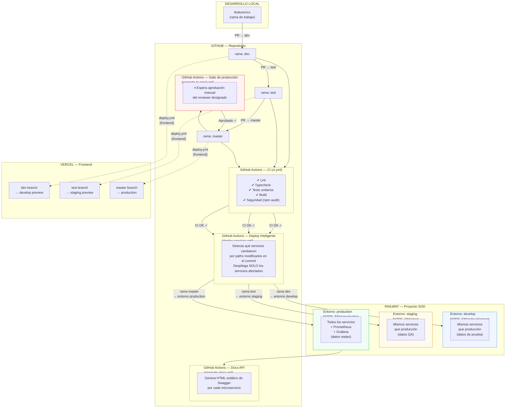
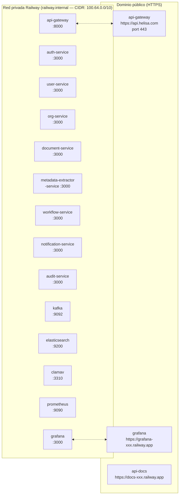

# Diagrama de Despliegue — Railway

**Versión:** 1.0  
**Fecha:** 2026-06-19  
**Sistema:** Sistema de Gestión Documental (SGD) Helisa

---

## Contenido

1. [Pipeline CI/CD y entornos](#1-pipeline-cicd-y-entornos)
2. [Infraestructura de despliegue — producción](#2-infraestructura-de-despliegue--producción)
3. [Inventario de servicios](#3-inventario-de-servicios)

---

## 1. Pipeline CI/CD y entornos

El sistema cuenta con tres entornos aislados en Railway, cada uno vinculado a una rama Git. El código solo avanza hacia producción a través de Pull Requests con CI obligatorio.

### Diferencias entre entornos

| Característica | develop | staging | production |
|---|---|---|---|
| Rama Git | `dev` | `test` | `master` |
| `NODE_ENV` | `development` | `test` | `production` |
| ClamAV requerido | No (`fail-open`) | No (`fail-open`) | **Sí** (`fail-closed`) |
| Prometheus + Grafana | No | No | **Sí** |
| Aprobación manual para deploy | No | No | **Sí** |
| JWT secrets | Únicos por entorno | Únicos por entorno | Únicos por entorno |
| Datos | Pruebas de desarrollo | QA | Reales |

---

## 2. Infraestructura de despliegue — producción

Topología completa de un entorno Railway. La misma estructura aplica a los tres entornos, con las diferencias indicadas en la tabla anterior.

```mermaid
graph TD
    %% ─── USUARIOS ───────────────────────────────────────────────────────────
    USER(["👤 Usuario final\n(navegador)"])

    %% ─── VERCEL ─────────────────────────────────────────────────────────────
    subgraph VERCEL["VERCEL — CDN Global"]
        SPA["SGD Frontend\nReact + Vite\nURL pública: sgd.helisa.com\n\nProxy /api/* → Railway API Gateway"]
    end

    %% ─── RAILWAY ─────────────────────────────────────────────────────────────
    subgraph RAILWAY["RAILWAY — Entorno production"]

        %% Gateway
        subgraph GW["API GATEWAY  (dominio público)"]
            KONG["Kong — DB-less\napi-gateway.railway.internal\nPuerto público: 443 (HTTPS)\nPuerto interno: 8000\n────────────────────\nJWT HS256 · Rate limiting\nCORS · Security headers"]
        end

        %% Microservicios
        subgraph SVC["MICROSERVICIOS  (*.railway.internal:3000)"]
            direction LR
            AUTH["auth-service\nJWT · sesiones\nrecuperación contraseña"]
            USER_SVC["user-service\nusuarios · roles\npermisos · avatares"]
            ORG["org-service\norganizaciones\nestructura org"]
            DOC["document-service\ntipologías\narchivos"]
            META["metadata-extractor\n-service\nextracción IA"]
            WF["workflow-service\nflujos documentales"]
            NOTIF["notification-service\nSSE tiempo real\nemail"]
            AUDIT["audit-service\nregistro inmutable"]
        end

        %% Mensajería
        subgraph MSG["MENSAJERÍA"]
            KAFKA["kafka\nkafka.railway.internal:9092\nApache Kafka (KRaft)\n23+ topics"]
        end

        %% Bases de datos Railway Plugins
        subgraph DB["BASES DE DATOS — Railway Plugins"]
            PG[("postgres\nPostgreSQL 15\n─────────────────\nauth_db\nuser_db\norg_db\nworkflow_db\nnotification_db")]
            REDIS[("redis\nRedis 7\n─────────────────\nrefresh tokens\nSSE tickets\ncaché permisos\nidempotencia")]
            MONGO[("mongodb\nMongoDB 7\n─────────────────\ntypologies")]
        end

        %% Servicios especializados (Docker)
        subgraph INFRA["SERVICIOS DE INFRAESTRUCTURA  (Docker)"]
            ES["elasticsearch\nelasticsearch.railway.internal:9200\nElasticsearch 8.11\naudit logs (búsqueda)"]
            CLAM["clamav\nclamav.railway.internal:3310\nClamAV daemon\nantivirus INSTREAM"]
        end

        %% Monitoreo (solo producción)
        subgraph MON["MONITOREO  (solo entorno production)"]
            PROM["prometheus\nprometheus.railway.internal:9090\nScraping /metrics\ncada 15 s"]
            GRAFANA["grafana\ndominio público\nDashboards\nlatencia · errores · uptime"]
        end

        %% Docs
        APIDOCS["api-docs\ndominio público\nNginx static\nSwagger HTML por servicio"]
    end

    %% ─── SERVICIOS EXTERNOS ──────────────────────────────────────────────────
    subgraph EXT["SERVICIOS EXTERNOS  (fuera de Railway)"]
        R2_DOC["Cloudflare R2\nbucket: documentos\ntipologías · adjuntos de workflows\ndocumentos principales"]
        R2_AVT["Cloudflare R2\nbucket: avatares\nfotos de perfil de usuarios"]
        RESEND["Resend\nEmail transaccional\nPassword reset · Invitaciones"]
    end

    %% ─── CONEXIONES: USUARIO → VERCEL → KONG ────────────────────────────────
    USER -->|"HTTPS"| SPA
    SPA -->|"HTTPS /api/*\nproxy Vercel → Railway"| KONG

    %% ─── CONEXIONES: KONG → MICROSERVICIOS ──────────────────────────────────
    KONG -->|"HTTP interno :3000"| AUTH
    KONG --> USER_SVC
    KONG --> ORG
    KONG --> DOC
    KONG --> WF
    KONG --> NOTIF
    KONG --> AUDIT

    %% ─── CONEXIONES: HTTP INTERNOS ENTRE SERVICIOS ───────────────────────────
    AUTH -->|"x-internal-token\n/internal/users/*"| USER_SVC
    USER_SVC -->|"x-internal-token\n/internal/auth/*"| AUTH
    ORG -->|"x-internal-token\n/internal/users/*"| USER_SVC
    WF -->|"x-internal-token\n/internal/typologies/*"| DOC

    %% ─── CONEXIONES: KAFKA ───────────────────────────────────────────────────
    AUTH -.->|"produce"| KAFKA
    USER_SVC -.->|"produce"| KAFKA
    DOC -.->|"produce / consume"| KAFKA
    META -.->|"produce / consume"| KAFKA
    WF -.->|"produce"| KAFKA
    KAFKA -.->|"consume"| NOTIF
    KAFKA -.->|"consume"| AUDIT

    %% ─── CONEXIONES: BASES DE DATOS ─────────────────────────────────────────
    AUTH --- PG
    USER_SVC --- PG
    ORG --- PG
    WF --- PG
    NOTIF --- PG

    DOC --- MONGO
    AUDIT --- ES

    AUTH --- REDIS
    USER_SVC --- REDIS
    WF --- REDIS
    NOTIF --- REDIS

    %% ─── CONEXIONES: ANTIVIRUS + STORAGE ────────────────────────────────────
    DOC -->|"INSTREAM TCP :3310\nescaneo antes de subir"| CLAM
    DOC -->|"S3 API\nupload / presigned URL"| R2_DOC
    META -->|"S3 API\nread-only"| R2_DOC
    WF -->|"S3 API\nadjuntos de workflows"| R2_DOC
    USER_SVC -->|"S3 API\navatares"| R2_AVT

    %% ─── CONEXIONES: EMAIL ───────────────────────────────────────────────────
    NOTIF -->|"REST API"| RESEND

    %% ─── CONEXIONES: MONITOREO ───────────────────────────────────────────────
    PROM -->|"GET /metrics\nscraping cada 15s"| AUTH
    PROM --> USER_SVC
    PROM --> ORG
    PROM --> DOC
    PROM --> META
    PROM --> WF
    PROM --> NOTIF
    PROM --> AUDIT
    PROM --> KONG
    GRAFANA -->|"PromQL queries"| PROM

    %% ─── ESTILOS ─────────────────────────────────────────────────────────────
    style KONG fill:#f0f9ff,stroke:#0284c7
    style KAFKA fill:#fef3c7,stroke:#d97706
    style PG fill:#f0fdf4,stroke:#16a34a
    style REDIS fill:#fff1f2,stroke:#e11d48
    style MONGO fill:#f0fdf4,stroke:#16a34a
    style ES fill:#faf5ff,stroke:#9333ea
    style CLAM fill:#fff7ed,stroke:#ea580c
    style PROM fill:#fff7ed,stroke:#ea580c
    style GRAFANA fill:#fdf4ff,stroke:#c026d3
    style R2_DOC fill:#eff6ff,stroke:#3b82f6
    style R2_AVT fill:#eff6ff,stroke:#3b82f6
    style RESEND fill:#eff6ff,stroke:#3b82f6
```

### Red interna de Railway

Todos los servicios dentro del mismo entorno se comunican por la red privada de Railway usando el patrón `<nombre-servicio>.railway.internal`. Esta red no es accesible desde internet.

---

## 3. Inventario de servicios

### Microservicios (código fuente — GitHub repo)

| Servicio | Hostname interno | Puerto | Base de datos | Rama → Entorno |
|---|---|---|---|---|
| `api-gateway` | `api-gateway.railway.internal` | 8000 | Ninguna (DB-less) | `railway/api-gateway/` |
| `auth-service` | `auth-service.railway.internal` | 3000 | PostgreSQL `auth_db` + Redis | `services/auth-service/` |
| `user-service` | `user-service.railway.internal` | 3000 | PostgreSQL `user_db` + Redis | `services/user-service/` |
| `org-service` | `org-service.railway.internal` | 3000 | PostgreSQL `org_db` | `services/org-service/` |
| `document-service` | `document-service.railway.internal` | 3000 | MongoDB | `services/document-service/` |
| `metadata-extractor-service` | `metadata-extractor-service.railway.internal` | 3000 | Ninguna (sin estado) | `services/metadata-extractor-service/` |
| `workflow-service` | `workflow-service.railway.internal` | 3000 | PostgreSQL `workflow_db` | `services/workflow-service/` |
| `notification-service` | `notification-service.railway.internal` | 3000 | PostgreSQL `notification_db` + Redis | `services/notification-service/` |
| `audit-service` | `audit-service.railway.internal` | 3000 | Elasticsearch | `services/audit-service/` |
| `prometheus` | `prometheus.railway.internal` | 9090 | Ninguna | `railway/monitoring/` |
| `api-docs` | `api-docs.railway.internal` | 80 | Ninguna | `railway/api-docs/` |

### Servicios de infraestructura (imagen Docker)

| Servicio | Imagen | Hostname interno | Puerto | Propósito |
|---|---|---|---|---|
| `kafka` | `apache/kafka:latest` | `kafka.railway.internal` | 9092, 9093 | Mensajería asíncrona (KRaft mode) |
| `elasticsearch` | `docker.elastic.co/elasticsearch/elasticsearch:8.11.0` | `elasticsearch.railway.internal` | 9200 | Búsqueda full-text de audit logs |
| `clamav` | `clamav/clamav:latest` | `clamav.railway.internal` | 3310 | Antivirus INSTREAM para archivos |
| `grafana` | `grafana/grafana:10.4.0` | `grafana.railway.internal` | 3000 | Dashboards de métricas |

### Plugins nativos de Railway (managed)

| Plugin | Variable Railway | Propósito |
|---|---|---|
| PostgreSQL 15 | `${{postgres.PGHOST}}`, `${{postgres.PGPORT}}`, `${{postgres.PGUSER}}`, `${{postgres.PGPASSWORD}}` | 5 bases de datos de microservicios |
| Redis 7 | `${{redis.REDISHOST}}`, `${{redis.REDISPORT}}`, `${{redis.REDISPASSWORD}}` | Caché efímero: tokens, tickets SSE, permisos |
| MongoDB 7 | `${{MongoDB.MONGO_URL}}` | Colección `typologies` del document-service |

### Servicios externos (fuera de Railway)

| Servicio | Protocolo | Usado por | Propósito |
|---|---|---|---|
| Cloudflare R2 (`documentos`) | S3 API (HTTPS) | document-service (RW), metadata-extractor-service (RO), workflow-service (RW) | Documentos de tipologías, adjuntos de workflows |
| Cloudflare R2 (`avatares`) | S3 API (HTTPS) | user-service (RW) | Fotos de perfil de usuarios |
| Resend | REST API (HTTPS) | notification-service | Email transaccional: invitaciones, recuperación de contraseña |

### Variables de entorno críticas compartidas

> Estas variables deben tener el mismo valor en todos los servicios que las usan dentro del mismo entorno. Un valor distinto entre servicios causa fallos de autenticación.

| Variable | Compartida entre | Descripción |
|---|---|---|
| `JWT_SECRET` | auth-service, user-service, org-service, document-service, workflow-service, notification-service, audit-service, Kong (`KONG_JWT_SECRET`) | Secreto de firma de tokens JWT. Distinto por entorno |
| `INTERNAL_TOKEN_AUTH_USER` | auth-service (emisor) ↔ user-service (receptor) | Token para llamadas auth → user |
| `INTERNAL_TOKEN_USER_AUTH` | user-service (emisor) ↔ auth-service (receptor) | Token para llamadas user → auth |
| `INTERNAL_TOKEN_ORG_USER` | org-service (emisor) ↔ user-service (receptor) | Token para llamadas org → user |
| `INTERNAL_TOKEN_USER_ORG` | user-service (emisor) ↔ org-service (receptor) | Token para llamadas user → org |
| `INTERNAL_TOKEN_WORKFLOW_DOC` | workflow-service (emisor) ↔ document-service (receptor) | Token para llamadas workflow → document |
| `INTERNAL_TOKEN_NOTIF_USER` | notification-service (emisor) ↔ user-service (receptor) | Token para llamadas notif → user |
| `INTERNAL_TOKEN_NOTIF_ORG` | notification-service (emisor) ↔ org-service (receptor) | Token para llamadas notif → org |
| `INTERNAL_ALLOWED_CIDRS` | Todos los servicios | `100.64.0.0/10` — CIDR de la red privada Railway |
