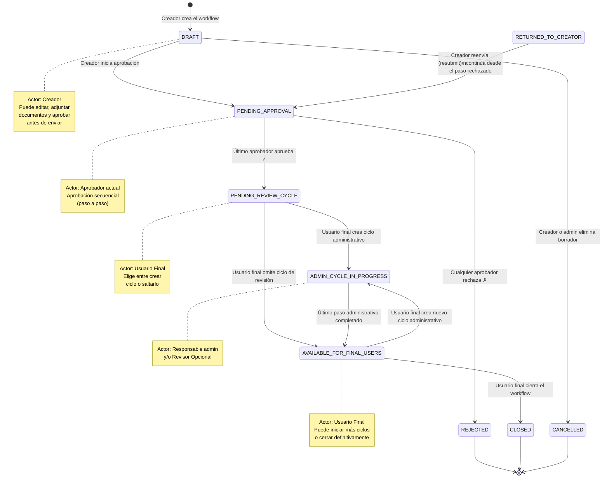

# Diagrama de Flujo — Workflow Documental

**Versión:** 1.0  
**Fecha:** 2026-06-19  
**Sistema:** Sistema de Gestión Documental (SGD) Helisa

---

## Contenido

1. [Diagrama de estados](#1-diagrama-de-estados)
2. [Flujo completo del proceso](#2-flujo-completo-del-proceso)
3. [Ciclo administrativo (detalle)](#3-ciclo-administrativo-detalle)

---

## 1. Diagrama de estados

Todos los estados posibles de un workflow y las transiciones válidas entre ellos.

### Tabla de transiciones

| Estado origen | Acción | Estado destino | Actor |
|---|---|---|---|
| `DRAFT` | Iniciar aprobación | `PENDING_APPROVAL` | Creador |
| `DRAFT` | Eliminar workflow | `CANCELLED` | Creador / SuperAdmin |
| `PENDING_APPROVAL` | Aprobar (paso intermedio) | `PENDING_APPROVAL` | Aprobador actual |
| `PENDING_APPROVAL` | Aprobar (último paso) | `PENDING_REVIEW_CYCLE` | Aprobador actual |
| `PENDING_APPROVAL` | Rechazar | `REJECTED` *(terminal)* | Aprobador actual |
| `RETURNED_TO_CREATOR` | Reenviar | `PENDING_APPROVAL` | Creador *(flujo legado)* |
| `PENDING_REVIEW_CYCLE` | Crear ciclo administrativo | `ADMIN_CYCLE_IN_PROGRESS` | Usuario Final |
| `PENDING_REVIEW_CYCLE` | Omitir ciclo de revisión | `AVAILABLE_FOR_FINAL_USERS` | Usuario Final |
| `AVAILABLE_FOR_FINAL_USERS` | Crear ciclo administrativo | `ADMIN_CYCLE_IN_PROGRESS` | Usuario Final |
| `AVAILABLE_FOR_FINAL_USERS` | Cerrar workflow | `CLOSED` *(terminal)* | Usuario Final |
| `ADMIN_CYCLE_IN_PROGRESS` | Completar último paso | `AVAILABLE_FOR_FINAL_USERS` | Responsable Admin |

**Estados terminales:** `REJECTED`, `CLOSED`, `CANCELLED` — no admiten ninguna transición posterior.

---

## 2. Flujo completo del proceso

```mermaid
flowchart TD
    START(["Inicio"])

    %% ─── FASE 1: CREACIÓN (DRAFT) ──────────────────────────────────────────
    subgraph FASE1["① CREACIÓN  —  Actor: Creador"]
        A1["Selecciona tipología documental\n(validada en document-service)"]
        A2["Carga documento principal\n(escaneo ClamAV → almacenado en R2)"]
        A3{"¿Metadatos del documento\ncoiniciden con la tipología?"}
        A4["Confirma / corrige metadatos\n(discrepancia resuelta)"]
        A5["Define aprobadores\n(lista secuencial ordenada por step_order)"]
        A6["Agrega adjuntos de soporte\n(opcional)"]
        A7["Asigna usuarios finales\n(opcional — se resuelven por estructura org si no se asignan)"]
        A8[["Workflow creado\nEstado: DRAFT"]]
    end

    START --> A1
    A1 --> A2
    A2 --> A3
    A3 -->|"Discrepancia detectada"| A4
    A4 --> A5
    A3 -->|"Sin discrepancia"| A5
    A5 --> A6
    A6 --> A7
    A7 --> A8

    %% ─── INICIO DE APROBACIÓN ───────────────────────────────────────────────
    A8 --> B0
    subgraph FASE1B["① ENVÍO A APROBACIÓN  —  Actor: Creador"]
        B0{"¿Workflow listo\npara enviar?"}
        B0E["Edita borrador\n(título, aprobadores,\ndocumento, adjuntos)"]
        B_PRE{"Validaciones previas:\n✔ Al menos 1 aprobador\n✔ Documento principal validado"}
        B_ERR(["Error: no puede\ninicar aprobación"])
        B1[["Aprobación iniciada\nEstado: PENDING_APPROVAL\nAprobador paso 1 notificado 🔔"]]
    end

    B0 -->|"Necesita ajustes"| B0E
    B0E --> B0
    B0 -->|"Listo para enviar"| B_PRE
    B_PRE -->|"Validación falla"| B_ERR
    B_PRE -->|"Validación OK"| B1

    %% ─── FASE 2: APROBACIÓN SECUENCIAL ─────────────────────────────────────
    subgraph FASE2["② APROBACIÓN SECUENCIAL  —  Actor: Aprobador (por turno)"]
        C1["Aprobador recibe notificación\n(WORKFLOW_TASK_ASSIGNED)"]
        C2["Revisa workflow y documento"]
        C3{"Decisión del\naprobador"}
        C4["Aprueba\n(puede adjuntar archivos\ny dejar observaciones)"]
        C5["Rechaza\n(debe dejar observaciones)"]
        C6{"¿Era el último\naprobador?"}
        C7[["PASO INTERMEDIO APROBADO\nSiguiente aprobador notificado 🔔\nEstado: sigue en PENDING_APPROVAL"]]
        C8[["APROBACIÓN COMPLETA\nEstado: PENDING_REVIEW_CYCLE\nUsuarios finales notificados 🔔"]]
        C9[["RECHAZADO definitivamente\nEstado: REJECTED ❌\nCreador y usuarios finales notificados 🔔"]]
    end

    B1 --> C1
    C1 --> C2
    C2 --> C3
    C3 -->|"Aprobar"| C4
    C3 -->|"Rechazar"| C5
    C4 --> C6
    C5 --> C9
    C6 -->|"No — hay más aprobadores"| C7
    C7 --> C1
    C6 -->|"Sí — último aprobador"| C8

    %% ─── FASE 3: REVISIÓN POR USUARIO FINAL ────────────────────────────────
    subgraph FASE3["③ RECEPCIÓN  —  Actor: Usuario Final"]
        D1["Usuario final recibe notificación\n(WORKFLOW_APPROVED)"]
        D2{"¿Requiere ciclo\nadministrativo?"}
        D3["Crea ciclo administrativo\n(define responsables y pasos)"]
        D4[["CICLO INICIADO\nEstado: ADMIN_CYCLE_IN_PROGRESS\nPrimer responsable admin notificado 🔔"]]
        D5[["OMITE CICLO\nEstado: AVAILABLE_FOR_FINAL_USERS"]]
    end

    C8 --> D1
    D1 --> D2
    D2 -->|"Sí — requiere trámite interno"| D3
    D3 --> D4
    D2 -->|"No — ir directo a disponible"| D5

    %% ─── FASE 4: CICLO ADMINISTRATIVO ──────────────────────────────────────
    subgraph FASE4["④ CICLO ADMINISTRATIVO  —  Actor: Responsables Admin"]
        E1["Responsable admin paso N\nrecibe notificación\n(ADMIN_CYCLE_TASK)"]
        E2["Ejecuta su tarea\n(puede adjuntar archivos\ny dejar notas)"]
        E3{"¿Reenviar a\nrevisor opcional?"}
        E4["Reenvía a revisor del pool\n(opcional reviewer)"]
        E5["Revisor opcional recibe\nnotificación y actúa"]
        E6{"¿Era el último\npaso del ciclo?"}
        E7[["PASO COMPLETADO\nSiguiente responsable notificado 🔔"]]
        E8[["CICLO COMPLETADO\nEstado: AVAILABLE_FOR_FINAL_USERS\nUsuario final notificado 🔔"]]
    end

    D4 --> E1
    E1 --> E2
    E2 --> E3
    E3 -->|"Sí — delega"| E4
    E4 --> E5
    E5 --> E6
    E3 -->|"No — completa directamente"| E6
    E6 -->|"No — hay más pasos"| E7
    E7 --> E1
    E6 -->|"Sí — último paso"| E8

    %% ─── FASE 5: DISPONIBLE PARA USUARIOS FINALES ──────────────────────────
    subgraph FASE5["⑤ DISPONIBLE  —  Actor: Usuario Final"]
        F1[["Estado: AVAILABLE_FOR_FINAL_USERS"]]
        F2{"¿Necesita otro\nciclo administrativo?"}
        F3["Crea nuevo ciclo administrativo\n(cycle_number incrementa)"]
        F4["Cierra el workflow\n(puede dejar notas de cierre)"]
        F5[["WORKFLOW CERRADO\nEstado: CLOSED ✅\nCreador notificado 🔔"]]
    end

    D5 --> F1
    E8 --> F1
    F1 --> F2
    F2 -->|"Sí — más trámites"| F3
    F3 --> D4
    F2 -->|"No — proceso finalizado"| F4
    F4 --> F5

    %% ─── ESTADOS TERMINALES ─────────────────────────────────────────────────
    C9 --> END_REJ(["FIN — Rechazado"])
    F5 --> END_OK(["FIN — Cerrado"])

    %% ─── ESTILOS ─────────────────────────────────────────────────────────────
    style C9 fill:#fee2e2,stroke:#ef4444,color:#7f1d1d
    style END_REJ fill:#fee2e2,stroke:#ef4444,color:#7f1d1d
    style F5 fill:#dcfce7,stroke:#22c55e,color:#14532d
    style END_OK fill:#dcfce7,stroke:#22c55e,color:#14532d
    style B_ERR fill:#fef9c3,stroke:#ca8a04,color:#713f12
```

---

## 3. Ciclo administrativo (detalle)

El ciclo administrativo es el proceso interno de tramitación que ocurre una vez que el workflow ha sido aprobado. Puede repetirse múltiples veces.

```mermaid
flowchart TD

    START(["Workflow en\nPENDING_REVIEW_CYCLE\no AVAILABLE_FOR_FINAL_USERS"])

    %% ─── CREACIÓN DEL CICLO ─────────────────────────────────────────────────
    subgraph CREACION["CREACIÓN DEL CICLO  —  Actor: Usuario Final"]
        C1["Define los pasos del ciclo\n(usuario responsable + step_order\nconsecutivo empezando en 1)"]
        C2["Define el pool de revisores opcionales\n(allowedOptionalReviewerIds)\nUsuarios con is_optional_reviewer=true\nen la org"]
        C3[["Ciclo #N creado\nEstado workflow: ADMIN_CYCLE_IN_PROGRESS\nResponsable paso 1 notificado 🔔"]]
    end

    START --> C1
    C1 --> C2
    C2 --> C3

    %% ─── EJECUCIÓN DE PASOS ─────────────────────────────────────────────────
    subgraph EJECUCION["EJECUCIÓN DE PASOS  —  Actor: Responsable Admin (turno actual)"]
        direction TB
        E1["Responsable del paso N\nrecibe notificación ADMIN_CYCLE_TASK"]
        E2["Revisa el workflow y documentos"]
        E3{"¿Qué acción\ntoma?"}

        subgraph COMPLETAR["Opción A — Completar directamente"]
            CA1["Adjunta archivos\n(opcional)"]
            CA2["Agrega notas\n(opcional)"]
            CA3["Marca paso como COMPLETADO"]
        end

        subgraph REENVIAR["Opción B — Reenviar a revisor opcional"]
            CB1{"¿El revisor está en\nel pool definido al\ncrear el ciclo?"}
            CB_ERR(["Error 400:\nrevisor no autorizado"])
            CB2["Adjunta archivos y/o notas\n(transferencia de contexto)"]
            CB3["Inserta paso opcional\nen la posición siguiente\n(desplaza los demás +1)"]
            CB4["Paso actual marcado\ncomo COMPLETADO"]
            CB5[["Revisor opcional notificado\n(ADMIN_CYCLE_TASK) 🔔"]]
        end

        subgraph REVISOR_OPC["Opcional — Actor: Revisor Opcional"]
            RO1["Revisor recibe notificación"]
            RO2["Ejecuta su revisión"]
            RO3["Adjunta archivos y/o notas"]
            RO4["Marca paso opcional\ncomo COMPLETADO"]
            RO_NOTE["⚠ Un revisor opcional\nNO puede reenviar\na otro revisor opcional"]
        end
    end

    C3 --> E1
    E1 --> E2
    E2 --> E3
    E3 -->|"Completa el paso"| CA1
    CA1 --> CA2
    CA2 --> CA3

    E3 -->|"Reenvía a revisor opcional"| CB1
    CB1 -->|"No está en el pool"| CB_ERR
    CB1 -->|"Sí está autorizado"| CB2
    CB2 --> CB3
    CB3 --> CB4
    CB4 --> CB5
    CB5 --> RO1
    RO1 --> RO2
    RO2 --> RO3
    RO3 --> RO4
    RO_NOTE -.->|"restricción"| RO4

    %% ─── DECISIÓN: ¿ÚLTIMO PASO? ────────────────────────────────────────────
    subgraph DECISION["AVANCE DEL CICLO"]
        D1{"¿Era el último\npaso del ciclo?"}
        D2[["Siguiente responsable\nnotificado 🔔\nCiclo continúa en paso N+1"]]
        D3[["CICLO COMPLETADO\nEstado ciclo: COMPLETED\nEstado workflow: AVAILABLE_FOR_FINAL_USERS\nUsuario final que inició el ciclo\nnotificado (ADMIN_CYCLE_COMPLETED) 🔔"]]
    end

    CA3 --> D1
    RO4 --> D1
    D1 -->|"No — hay más pasos"| D2
    D2 --> E1
    D1 -->|"Sí — último paso"| D3

    %% ─── RESULTADO ──────────────────────────────────────────────────────────
    D3 --> END(["Workflow disponible\npara el usuario final\n→ puede crear otro ciclo\no cerrar el workflow"])

    %% ─── ESTILOS ─────────────────────────────────────────────────────────────
    style CB_ERR fill:#fef9c3,stroke:#ca8a04,color:#713f12
    style D3 fill:#dcfce7,stroke:#22c55e,color:#14532d
    style END fill:#dcfce7,stroke:#22c55e,color:#14532d
    style RO_NOTE fill:#f0f9ff,stroke:#0ea5e9,color:#0c4a6e
```

---

## Reglas de negocio relevantes

| ID | Regla |
|---|---|
| RN-01 | Solo el **creador** del workflow puede iniciar el ciclo de aprobación |
| RN-02 | El workflow debe tener **al menos 1 aprobador** definido para iniciar aprobación |
| RN-03 | El **documento principal** debe estar validado (metadatos confirmados) antes de iniciar aprobación |
| RN-04 | Solo el **aprobador del paso activo** puede aprobar o rechazar |
| RN-05 | El rechazo en cualquier paso envía el workflow a estado **REJECTED** (terminal). No hay vuelta atrás |
| RN-06 | Tras rechazo, el creador puede corregir y reenviar (**resubmit**) — el workflow retoma desde el paso rechazado, no desde el inicio |
| RN-07 | Solo los **usuarios finales** designados pueden crear ciclos administrativos |
| RN-08 | No puede existir más de un **ciclo administrativo activo** simultáneamente |
| RN-09 | Solo el **usuario asignado** al paso administrativo activo puede completarlo |
| RN-10 | Un revisor opcional **no puede reenviar** su paso a otro revisor opcional |
| RN-11 | Solo el **revisor opcional autorizado** (del pool definido al crear el ciclo) puede recibir reenvíos |
| RN-12 | Solo los **usuarios finales** pueden cerrar un workflow |
| RN-13 | Solo se puede cerrar un workflow en estado **AVAILABLE_FOR_FINAL_USERS** |
| RN-14 | Solo workflows en estado **DRAFT** o **CANCELLED** pueden eliminarse permanentemente |
| RN-15 | Al aprobar el último paso, si no hay usuarios finales asignados explícitamente, el sistema los **resuelve automáticamente** por la estructura organizacional de la tipología (cargo, área, departamento) |

---

## Notificaciones por evento

| Evento | Destinatario | Tipo de notificación |
|---|---|---|
| Workflow enviado a aprobación | Aprobador del paso 1 | `WORKFLOW_TASK_ASSIGNED` |
| Paso aprobado (no último) | Aprobador del siguiente paso | `WORKFLOW_TASK_ASSIGNED` |
| Todos los pasos aprobados | Usuarios finales | `WORKFLOW_APPROVED` |
| Paso rechazado | Creador + usuarios finales | `WORKFLOW_REJECTED` |
| Ciclo administrativo creado | Responsable del paso 1 | `ADMIN_CYCLE_TASK` |
| Paso admin completado (no último) | Responsable del siguiente paso | `ADMIN_CYCLE_TASK` |
| Revisor opcional asignado | Revisor opcional | `ADMIN_CYCLE_TASK` |
| Ciclo administrativo completado | Usuario final que inició el ciclo | `ADMIN_CYCLE_COMPLETED` |
| Workflow cerrado | Creador del workflow | `WORKFLOW_CLOSED` |
| Sin usuarios finales disponibles | Administrador | `NO_FINAL_USER_ALERT` |
